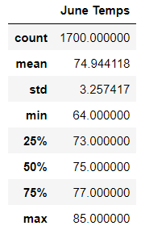
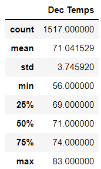

# surfs_up

## About this project
Oahu weather data was queried to provide insight for investors of a surf and ice cream shop business on whether it would be sustainable year-round. 

## Resources
### Data sources
* hawaii.sqlite

### Software
* Jupyter Notebook 6.3.0
* SQLalchemy 1.4.7
* Visual Studio Code 1.62.3

## Results
### Highlights
* On average, June (average temperature: 74°F) is slightly warmer than December (average temperature: 71°F).
* Extreme temperatures (min, max) for June and December appear to follow the trend of averages, slightly warmer in June than December. 

* June has more temperature data points than December (1700 points vs. 1517 points, respectively).

## Summary
In summary, temperature data for 2 months of the year as in the initial analysis do not lend enough information for action. If the aim of the analysis is to assess sustainability of the business around the year, the analysis should consider more metrics important to surfers and tourists who would be the primary target audiences for this business, the more favorable the conditions the more likely this location will have traffic. Hence, I would perform the following additional work:
* Perform analyses on all months instead of only two months to provide more accurate yearly trends.
* Retrieve/source metrics surfers would consider such as surf height, tide height, wind speed and direction, swell locations. E.g.
* Retrieve/source metrics non-surf tourists would consider such as UV index and simple weather descriptions like 'sunny' or 'overcast'.
With this new information, we would be able to perform summary statistics on metrics like surf and tide height and wind speed and determine their trends throughout the year alongside temperature and precipitation. We could also query counts for other metrics like weather descriptions, determine how many days in the year each weather condition occured. 
